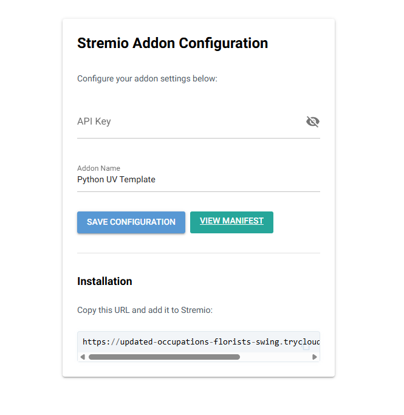
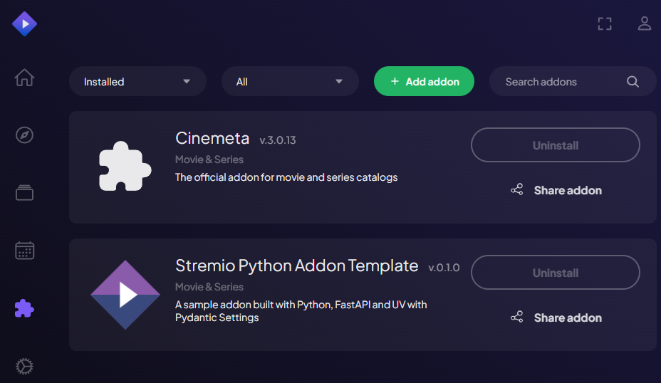

<div align="center">


<h1>Stremio Python Addon Template</h1>

<p>This project is a high-performance, asynchronous template for creating Stremio Addons.</p>
<p>Check my <a href="https://github.com/AmineDjeghri/generative-ai-project-template">Generative AI Project Template</a></p>


</div>

<div align="center">

[](https://www.stremio.com/)
[](https://www.python.org/downloads/release/python-3110/)
[](https://www.debian.org/)
[](#)

[](https://github.com/astral-sh/uv)
[](https://github.com/charliermarsh/ruff)
[](#)
[](#)
[](#)


</div>

<!-- TOC -->
  * [About The Project](#about-the-project)
    * [Key Components](#key-components)
  * [👥  Authors](#-authors)
  * [🧠 Features](#-features)
  * [1. Getting started](#1-getting-started)
    * [1.1. Local Prerequisites](#11-local-prerequisites)
    * [1.2 Installation](#12-installation)
    * [1.3 Usage](#13-usage)
      * [Check the documentation](#check-the-documentation)
  * [2. Contributing (For developers)](#2-contributing-for-developers)
<!-- TOC -->


## About The Project

There are many Stremio addon templates, but most are focused on Node.js. This template brings the power of **Python**, **FastAPI**, and **UV** to the ecosystem, prioritizing speed, reliability, and modern development practices.

This is a **production-ready template** designed to be cloned and customized for your specific addon needs. It's structured as a Python package that runs as a web service implementing the **Stremio Addon Protocol**.

### Key Components

- **Stremio Addon** (`src/stremio_addon_python_template/`): FastAPI server implementing the Stremio protocol
  - `/manifest.json` - Addon capabilities and metadata
  - `/catalog/{type}/{id}.json` - Content catalogs
  - `/stream/{type}/{id}.json` - Stream sources
  - `/configure` - NiceGUI-powered configuration interface

- **Configuration UI** (`/configure`): Interactive web interface built with NiceGUI
  - User-friendly addon configuration
  - Dynamic manifest URL generation (works with both localhost and cloudflared)
  - No manual URL editing required

- **Tests** (`tests/`): Comprehensive unit tests using pytest
  - API endpoint testing
  - Manifest validation
  - Stream response verification


## 👥  Authors
- (Author) Amine DJEGHRI

## 🧠 Features

**Engineering tools:**

- [x] Use UV to manage packages
- [x] pre-commit hooks: use ``ruff`` to ensure the code quality & ``detect-secrets`` to scan the secrets in the code.
- [x] Logging using loguru (with colors)
- [x] Pytest for unit tests
- [ ] Dockerized project (Dockerfile) both for development and production
- [x] NiceGUI configuration page for easy addon setup
- [x] Make commands to handle everything for you: install, run, test
- [x] Cloudflared for HTTPS (Stremio requires HTTPS)

**CI/CD & Maintenance tools:**

- [x] CI/CD pipelines: ``.github/workflows`` for GitHub
- [x] Local CI/CD pipelines: GitHub Actions using ``github act``
- [x] GitHub Actions for deploying to GitHub Pages with mkdocs gh-deploy
- [x] Dependabot for automatic dependency and security updates

**Documentation tools:**

- [x] Wiki creation and setup of documentation website using Mkdocs
- [x] GitHub Actions for deploying to GitHub Pages with mkdocs gh-deploy

## 1. Getting started

The following files are used in the contribution pipeline:

- ``.env.example``: example of the .env file.
- ``.env`` : contains the environment variables used by the app.
- ``Makefile``: contains the commands to run the app locally.
- ``Dockerfile``: the dockerfile used to build the project inside a container. It uses the Makefile commands to run the app.
- ``.pre-commit-config.yaml``: pre-commit hooks configuration file
- ``pyproject.toml``: contains the pytest, ruff & other configurations.
- ``src/env_settings.py``: logger using logguru and settings  using pydantic.
  the frontend.
- `.github/workflows/**.yml`: GitHub actions configuration files.
- ``.github/dependabot.yml``: dependabot configuration file.
- ``.gitignore``: contains the files to ignore in the project.

### 1.1. Local Prerequisites
- This project installs everything needed using the `make` command. If you don't have `make`, you need to install it or use [uv](https://docs.astral.sh/uv/).

### 1.2 Installation
`git clone the repo
cd stremio-addon-python-template`

- For development: Install dev dependencies with `make install-dev` or `uv sync --dev`
- For production: Install dependencies with `make install` or `uv sync`

### 1.3 Usage

- Start the server with either
  - ``make run`` or with `uv run src/stremio_addon_python_template/main.py`

- You will se the following image : 

- **Configuration Page**: Visit http://127.0.0.1:7000/ or http://127.0.0.1:7000/configure to access the NiceGUI configuration interface where you can:
  - Enter your API key
  - Configure addon settings
  - View the manifest URL for Stremio installation

- **Manifest**: Access the addon manifest at http://127.0.0.1:7000/manifest.json, you will see:
```json
{"id":"","version":"1.0.0","name":"Python UV Template","description":"A sample addon built with Python, FastAPI and UV with Pydantic Settings","logo":"https://dl.strem.io/addon-logo.png","resources":["stream","catalog"],"types":["movie","series"],"catalogs":[{"type":"movie","id":"python_movies","name":"Python Examples"}],"idPrefixes":["tt"]}
```
- **API Documentation**: Access the FastAPI docs at http://127.0.0.1:7000/docs

To use the addon in stremio for testing, you need to use cloudflare, or localtunnel or caddy because Stremio requires HTTPS.
- Install once
```
wget https://github.com/cloudflare/cloudflared/releases/latest/download/cloudflared-linux-amd64.deb

sudo dpkg -i cloudflared-linux-amd64.deb
```
- Run this everytime you need to access your addon using Stremio or any other app that requires HTTPS:
`cloudflared tunnel --url http://localhost:7000`

This gives you a URL like https://random.trycloudflare.com/
- Paste it in your browser first to make sure it works, for example: https://random.trycloudflare.com/manifest.json
- Open Stremio and add the Addon.
- 
- Scroll down in the Board where you have your catalogs, you will see your addon.
- 
- Everytime you restart your cloudflared, a new URL is generated, so you need to add the new url to stremio.

All the URLs:
✅ http://127.0.0.1:7000/ → redirects to /configure
✅ http://127.0.0.1:7000/configure → NiceGUI configuration page
✅ http://127.0.0.1:7000/manifest.json → addon manifest
✅ http://127.0.0.1:7000/catalog/{type}/{id}.json → catalog endpoint
✅ http://127.0.0.1:7000/stream/{type}/{id}.json → stream endpoint
⚠️ The URL to copy to Stremio addons is the one generated by cloudflared.

#### Check the documentation
You can check the documentation (website).

## 2. Contributing (For developers)
Check the [CONTRIBUTING.md](CONTRIBUTING.md) file for more information.
